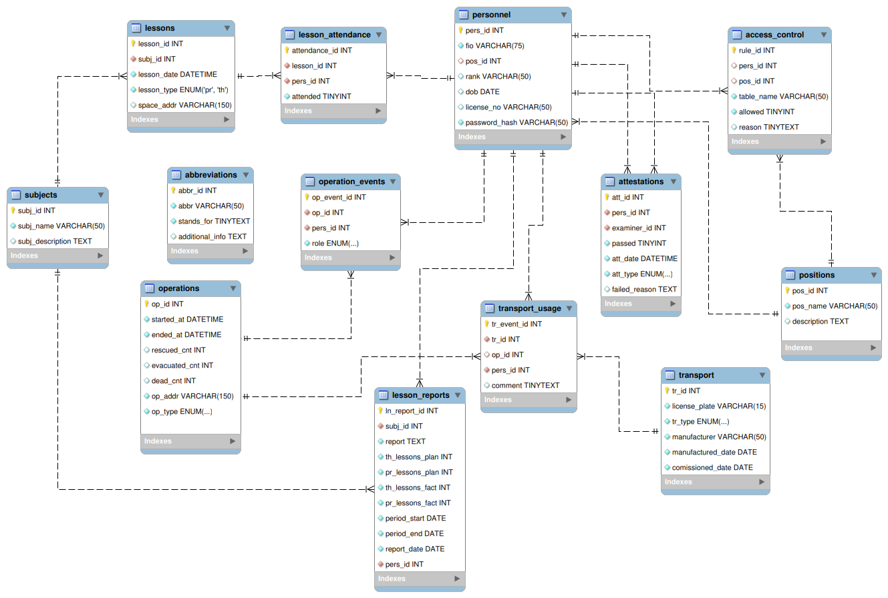

# Проект базы данных  для системы электронного документооборота МЧС

Зачетный проект №4 по дисциплине "Базы данных".

Над проектом работали студенты 2-го курса направления "ИВТ":

- Арсений Величко
- Иван Галкин
- Сергей Кононов

РГПУ им. А.И. Герцена, 2022г.

## ER-диаграмма (Lucid chart)

## ER-диаграмма (Mysql Workbench)

## Отчет о выполнении работы

Доступен по [ссылке](https://docs.google.com/document/d/1qa6EisxqVaP7xhw6yksKoGB1aLuq8Oss6tL6V4LbIbk/edit?usp=sharing)
